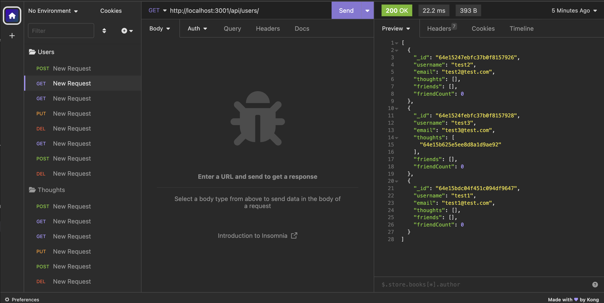

# social-network-api
An API for a social network web application where users can share their thoughts, react to friends’ thoughts, and create a friend list.

## Usage and Installation

Please be sure to install all dependencies `npm install` before running the server. Utilize the command line on your machine to run the server: `npm start`.

[Walkthrough Video](https://watch.screencastify.com/v/T4PXbH546N6VsO28J703)

Screenshot of application test example in Insomnia:

## Credits

While I wrote the code for this repository, I also received support from a tutor to finish the thoughtController.js file and to run tests in Insomnia.  

## License

Please refer to the LICENSE in the repo.